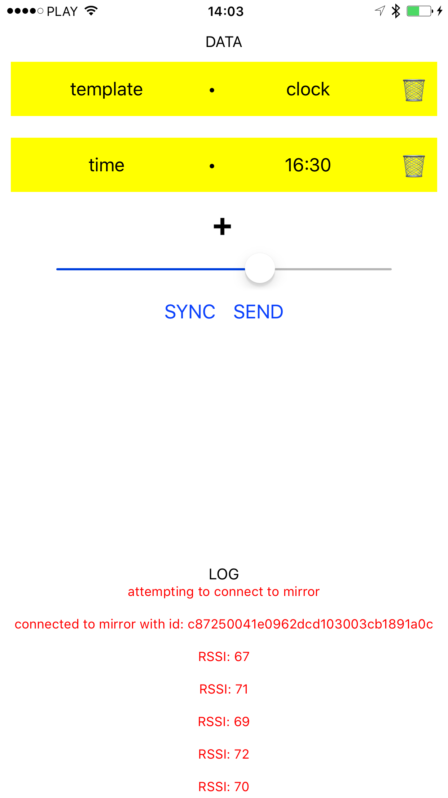

# iOS Mirrorator 

Send data over Bluetooth to your Mirror templates!

## Build and run 🏃‍

You'll require the [react native cli](https://facebook.github.io/react-native/docs/getting-started.html) to build and run the project.
Run:
> `$ brew install node`

> `$ brew install watchman`

> `$ npm install -g react-native-cli`

Lastly, from root of the project run:
> `$ npm install`

Now you can build and run the example project from Xcode on your iDevice!

## Example

Fill the key-value pairs with whatever string data you wish to send to your Mirror.



Then, on tapping send, your hypothetical `clock` template that is located on Mirror prints the message in console in the listener closure:

```html
<!doctype html>
<html>
<head>
    <meta charset="utf-8" />
    <script>
        if (window.mirror) {
            mirror.init();
            mirror.listen(Mirror.Events.USER_DATA, {
                ondata: function(ev) {
                    console.log(ev) // <- prints the message received
                },
                ondisconnect: function(ev) {}
            })
        }
    </script>
</head>
<body>
    <div id="content"></div>
</body>
</html>
```

## Authentication

Sending messages to Mirror requires your authentication.

Add your [`appID` and `appToken`](https://community.estimote.com/hc/en-us/articles/203607313-What-are-App-ID-and-App-Token-and-what-do-I-need-them-for-) to respecive fields [in the `AppDelegate.m`](https://github.com/Estimote/iOS-Mirror-SDK/blob/master/Examples/Mirrorator/ios/Mirrorator/AppDelegate.m#L20) in order to send messages to any Mirror that is in `Deployed and Protected` access mode.

Mirrors that are in the `Development` access mode require no authentication.

Find and edit your Mirror settings in the Estimote Cloud dashboard!

