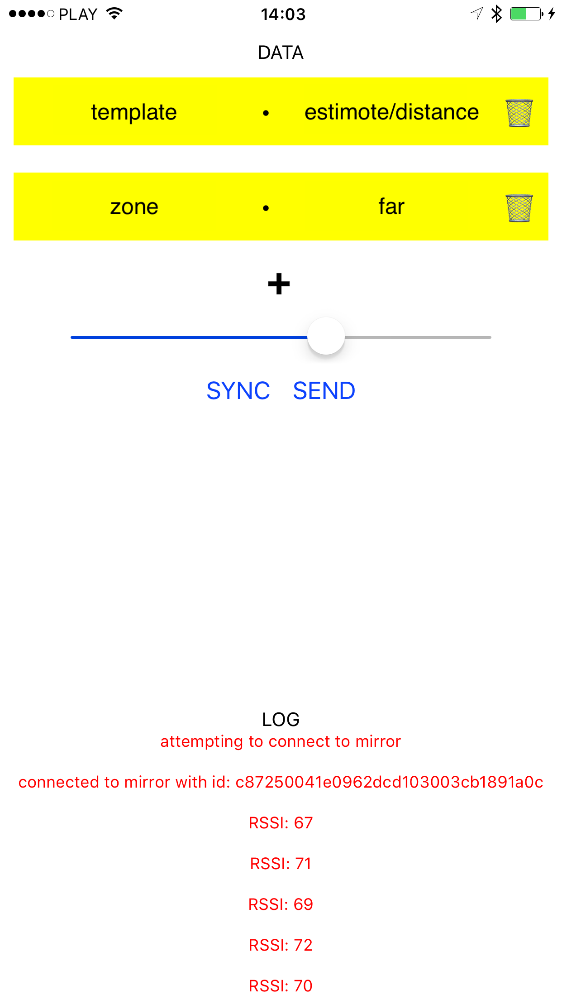

# iOS Mirrorator 

Mirrorator is a prototyping tool for developing custom templates on Mirror. Switch between templats and populate them with data in a breeze! Develop a custom template for Mirror by following the instructions in [the Estimote Dev Portal](http://developer.estimote.com/mirror/build-your-own-template/). 🤘 

### TL;DR
Send data over Bluetooth to your Mirror templates!

[Download the app to your phone and give it a try.](https://rink.hockeyapp.net/apps/20776ab5ac464eb2bf9ef8edc09f2b96)

## Example

<p align="center">
    
</p>

Fill the key-value pairs just as in the image above.

On tapping `send`, the Estimote `distance` template that is located on Mirror, will be launched with the specified configuration - in this case, the `zone` will be `far`.

Inside the HTML template script we simply listen for user data events.

```js
if (window.mirror) {
    mirror.init();
    mirror.listen(Mirror.Events.USER_DATA, {
        ondata: function(ev) {
            // do something with the received data
        },
        ondisconnect: function(ev) {}
    })
}
```

## Build and run 🏃‍

You'll require the [react native cli](https://facebook.github.io/react-native/docs/getting-started.html) to build and run the project.
Run:
> `$ brew install node`

> `$ brew install watchman`

> `$ npm install -g react-native-cli`

Lastly, from root of the project run:
> `$ npm install`

Now you can build and run the example project from Xcode on your iDevice!

## Authentication

Sending messages to Mirror requires your authentication.

Add your [`appID` and `appToken`](https://community.estimote.com/hc/en-us/articles/203607313-What-are-App-ID-and-App-Token-and-what-do-I-need-them-for-) to respecive fields [in the `AppDelegate.m`](https://github.com/Estimote/iOS-Mirror-SDK/blob/master/Examples/Mirrorator/ios/Mirrorator/AppDelegate.m#L20) in order to send messages to any Mirror that is in `Deployed and Protected` access mode.

Mirrors that are in the `Development` access mode require no authentication.

Find and edit your Mirror settings in the Estimote Cloud dashboard!

